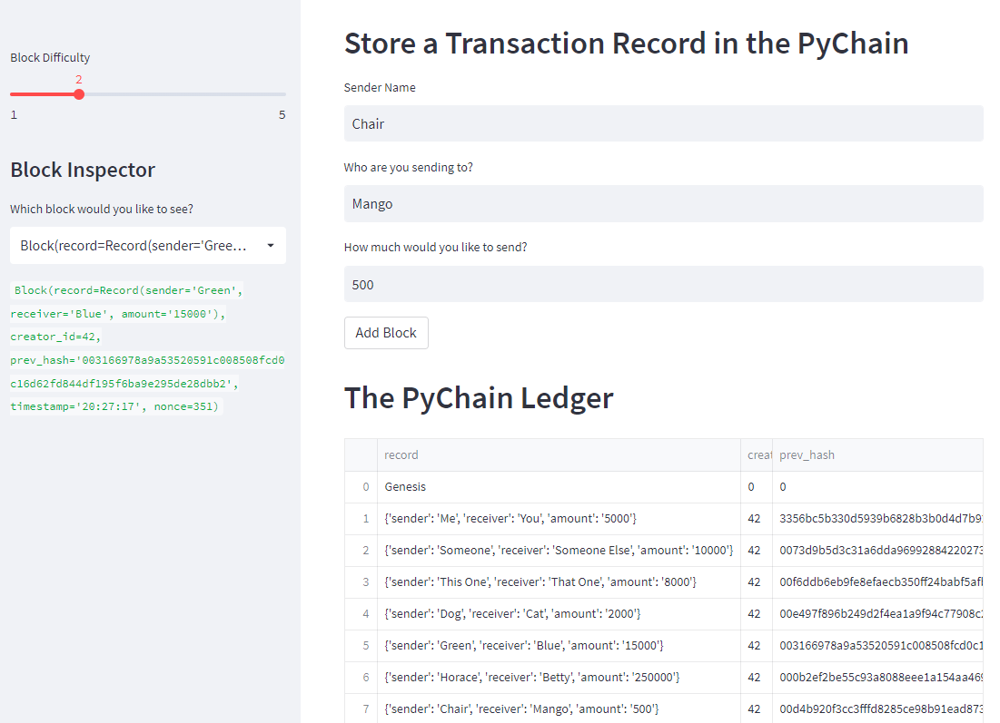
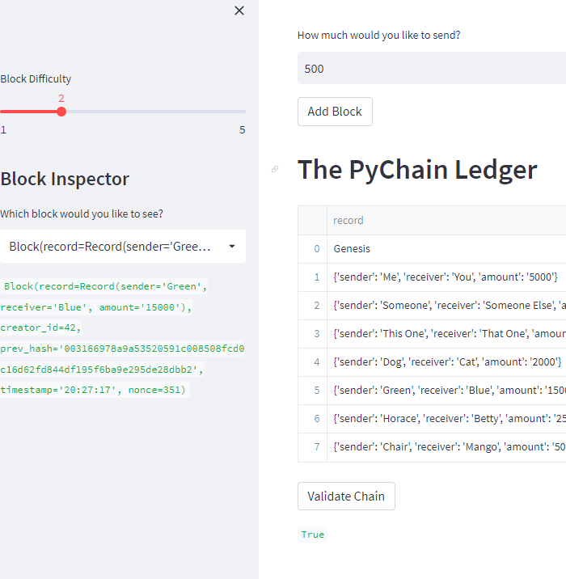

# Blockchain Ledger

Using streamlit to transact on a simple blockchain based ledger system with hashing and validation. 

## Technologies

Built on python 3.7 using: 

[streamlit](https://streamlit.io/) - to build the web based interactive interface

[pandas](https://pandas.pydata.org/) - to record the transactions in a dataframe

## Output

A working chain containing multiple entries:

Validated chain:
